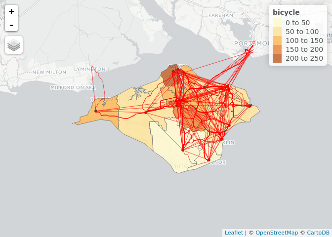

Demonstrating the PCT, for education and reproducibility
================

Welcome to pct-demo, a small repo with a little code and data to how how the pct works.

The starting point is that regional data has already been generated. See [pct-scripts](https://github.com/pctbike/pct-scripts) or an academic paper on the subject ([Lovelace et al. 2017](https://www.jtlu.org/index.php/jtlu/article/view/862)).

We also assume your have R and RStudio installed and running on your computer. There is plenty of guidance online, notably on the RStudio website: [rstudio.com](https://www.rstudio.com/products/rstudio/download/).

The first step is to download the the repo <https://github.com/npct/pct-demo/archive/master.zip> - that contains both code and data. Note that it contains a .qgs file that can be opened with the open source program [QGIS](http://qgis.org/) - another powerful tool for analysing the geographical distribution of cycling potential.

The remainder of this tutorial is based on R code, which can be found in the [code](https://github.com/npct/pct-demo/tree/master/code) folder. We encourage you to look over these scripts. The script to load-in the data, for example, can be opened with the following command:

``` r
file.edit("code/load-data.R")
```

Once that file is open we can run it line-by-line, e.g. by pressing `Ctl-Enter`. Alternatively you can entirety of a script file with the `source()` function.

There are some dependencies: you need to have some packages installed.

``` r
source("code/set-up.R")
```

    ## Loading required package: sp

    ## Linking to GEOS 3.5.1, GDAL 2.2.1, proj.4 4.9.2, lwgeom 2.3.3 r15473

To load the input data, we can run the following script:

``` r
source("code/load-data.R")
```

Zones, centroids, lines, routes
-------------------------------

The input data we have just loaded can be seen by looking in the Environment tab in RStudio. Alternatively you can use the function `ls()`:

``` r
ls()
```

    ## [1] "cents"      "l"          "pkgs"       "rf"         "rnet"      
    ## [6] "rq"         "to_install" "z"

This shows that we have loaded the following data objects:

-   `z`, administrative zones about which we have cycling data
-   `cents`, population-weighted centroids, one per zone
-   `l`, straight 'desire lines' representing travel between one zone and another
-   `rf` route-level data, like `l` but allocated to the road network

We can plot all these layers interactively as follows:

``` r
library(tmap)
tmap_mode("view")
```

    ## tmap mode set to interactive viewing

``` r
qtm(z, "bicycle") +
  qtm(cents) +
  qtm(l) +
  qtm(rf, col = "green")
```


